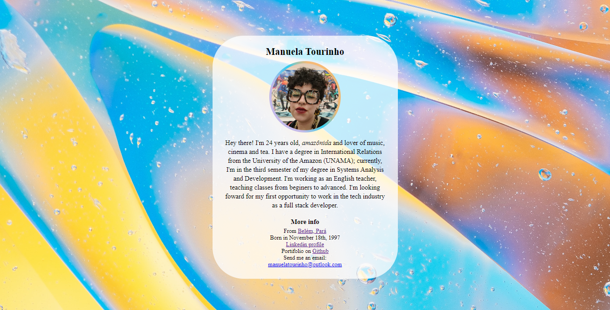

# Basic bio

To track every bit of my development through the codar.me's input course, I plan to submit my my results and resolutions of the proposed challenges. 

This page corresponds to the first challenge, creating a basic biography, using the HTML tags.

(2nd commit: Adding the CSS style, corresponding the third challenge proposed)

[Click here to acess](https://manutourinho.github.io/basic-bio/)

## ⚙️ Tecnologies

— CSS
— HTML
 
## 💗 Contact

manuelatourinho@outlook.com 
manuelatourinhodeoliveira@gmail.com

